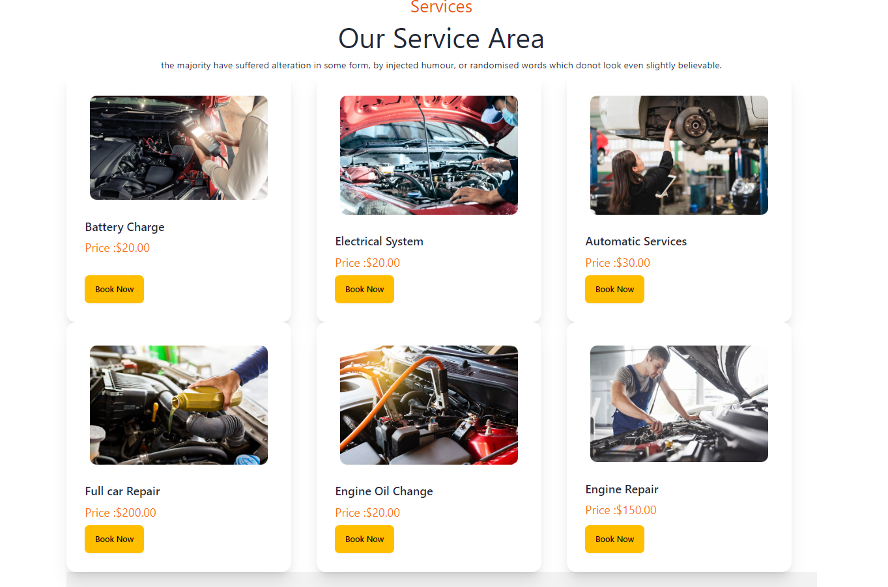
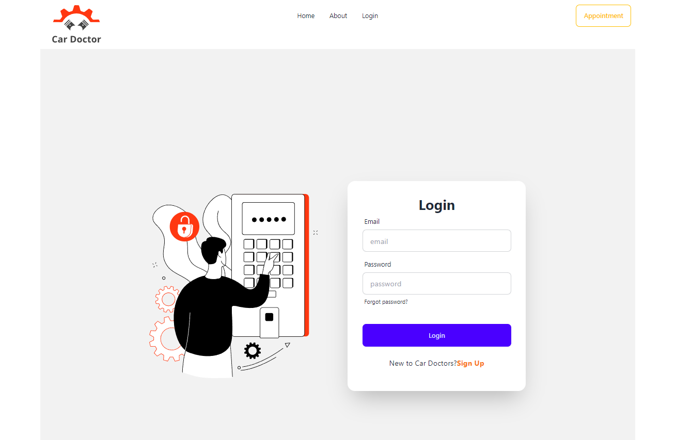
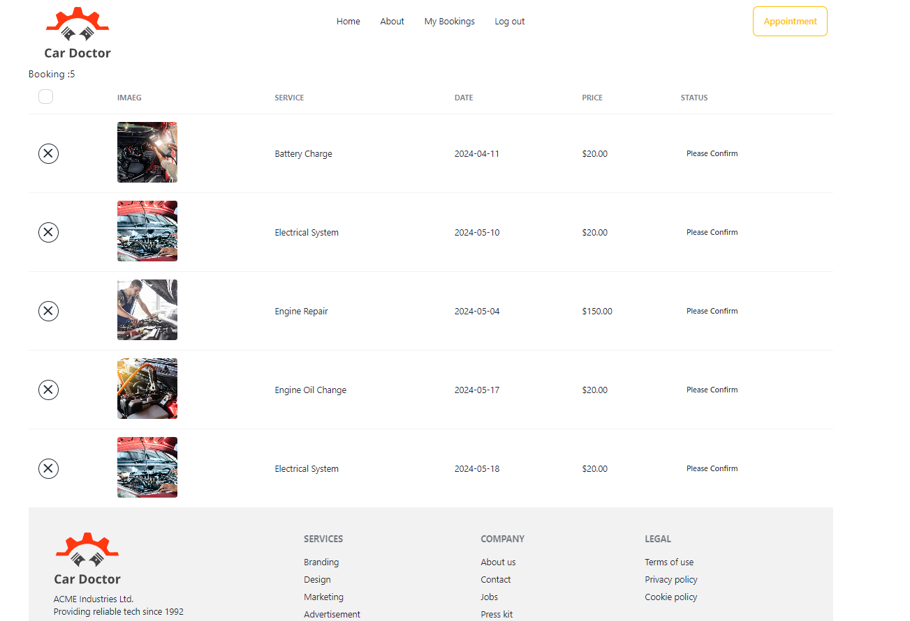

# CAR SERVICE CENTER

# Project Overview

The Car Service Center Website is a comprehensive web application designed to streamline the operations of a car service center. It allows customers to schedule appointments, track their service history, and manage invoices. The system also helps the service center manage inventory and service records efficiently.

# Technologies Used

````
```Frontend: HTML, CSS, JavaScript, React.js,

```Backend: Node.js, Express.js,

```Database: MongoDB,

```Authentication: JWT (JSON Web Tokens),

```Version Control: Git, GitHub,

```Deployment: Vercel
````

# Images of Site





